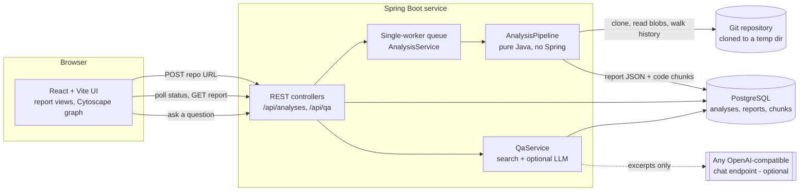

# Architecture

This describes how CodeAtlas is put together and why. What each number *means* is in
[metrics.md](metrics.md); how well the computed rankings actually work is in
[evaluation.md](evaluation.md).

## The shape of the system

Three deliberate boundaries:

- **`AnalysisPipeline` has no Spring in it.** It takes an opened JGit repository and returns a report
  object. That is what lets the same code run inside the web service, inside the offline
  `AnalyzeCommand` that produced the demo reports, and inside the evaluation harness, with no HTTP,
  no database and no container in the way. The evaluation in `docs/evaluation.md` would have been
  impractical otherwise — it runs the pipeline over 20 repositories in a loop.
- **The report is a JSON document, not a set of tables.** The schema is
  [report-schema.md](report-schema.md). The database stores it as a single `json` column (`json`, not
  `jsonb`, so key order survives and the file a user downloads is the file the server produced). Views
  in the UI read from that one document; there is no per-section API.
- **The language model is optional and sees nothing but excerpts.** With no model configured the Ask
  tab still works and returns matching code. That keeps the interesting part — retrieval and citation
  checking — measurable without a model in the loop.

## Analysis pipeline

One pass over the repository, in this order (`pipeline/AnalysisPipeline.java`):

| # | Stage | What happens | Key classes |
|---|---|---|---|
| 1 | Inventory | Walk the tree at HEAD, classify each file (language, vendored, generated, test) | `fetch/FileInventory`, `fetch/FileClassifier` |
| 2 | Parse | Tree-sitter parse of every Python file; imports and definitions pulled out with tree-sitter *queries* | `parse/PythonParser` |
| 3 | Imports | Resolve each import against the file list into a graph edge, with the line it came from | `parse/ImportResolver`, `analyze/ImportGraph` |
| 4 | History | Walk up to `maxCommits` commits: per-file churn, co-change pairs, author identities | `gitmine/HistoryMiner`, `gitmine/IdentityResolver` |
| 5 | Blame | Blame the most-changed files in parallel, whitespace ignored, `.git-blame-ignore-revs` honoured | `gitmine/BlameMiner` |
| 6 | Analyze | Reading order, ownership, coupling, hotspots, layers and cycles | `analyze/*` |
| 7 | Findings | Duplicate logic, cycles, committed build output, untested areas, unreferenced modules | `analyze/Findings` |
| 8 | Chunk | Split files into retrievable pieces and index them for full-text search | `index/Chunker` |

Stages 1–5 are the expensive ones and report progress, so the UI can show a real percentage instead of
a spinner. Blame is the slowest by a wide margin, which is why it is the only parallel stage and the
only one with a file cap (`CODEATLAS_MAX_BLAME_FILES`, most-changed files first).

### Why Tree-sitter, and why queries

Python's own `ast` module was not an option from a Java service, and regular expressions get imports
wrong in exactly the cases that matter (conditional imports, `try`/`except ImportError`, relative
imports). Tree-sitter parses broken files too, which matters when walking history.

Extraction is written as tree-sitter *queries* rather than a hand-written walk of the syntax tree in
Java. A spike measured this: queries were about five times faster, because the traversal stays inside
the native library instead of crossing the JNI boundary once per node.

The JNI binding (`io.github.bonede:tree-sitter`) is used rather than the official `jtreesitter`,
which requires Java 23; this project targets Java 17.

### Why only Python is parsed

Every language needs its own grammar, its own import-resolution rules and its own set of "what counts
as a definition" decisions. One language done properly — resolution that handles packages, relative
imports and `__init__.py` re-exports, and that is checked against real repositories — is worth more
than four done by regex. Everything derived from git (ownership, coupling, hotspots, churn) is
language-independent and works on the whole repository regardless.

## Storage

PostgreSQL with Flyway migrations (`V1__baseline`, `V2__analysis`, `V3__chunks`):

- `analysis` — one row per run: repo, status, progress, timings, error, and the whole report in a
  single `json` column.
- `chunk` — code pieces with a generated `tsvector` column and a GIN index, used for question
  answering. Symbol name, path and body are weighted A, B and C respectively, so a query that names a
  symbol ranks its definition above a file that merely mentions it.
  Chunks are only kept for the newest analyses; older ones are dropped.

Search is Postgres full-text rather than embeddings. That was a choice, not a limitation: it needs no
model, no extra service and no dimension bookkeeping, it is exactly reproducible, and — measured —
it finds the definition of a named symbol in the top 8 results 98–100% of the time on the two
repositories tested. Getting there took two fixes the measurement exposed: OR-ing query terms instead
of AND-ing them, and exempting definitional matches from the per-file diversity cap.

## Concurrency and limits

Analyses run on a single worker thread with a bounded queue (`jobs/AnalysisService`). One repository
is cloned and analyzed at a time; further requests queue up to `CODEATLAS_MAX_QUEUED` and are then
refused with a clear error. This is a deliberate fit to a free hosting tier: one CPU, 512 MB, and a
cold repository clone that is mostly I/O. The caps (`MAX_COMMITS`, `MAX_BLAME_FILES`, `MAX_CHUNKS`,
clone timeout, questions per hour) all exist so that one large repository cannot take the server down.

Clones go to a temp directory and are deleted when the analysis ends. Accepting local filesystem paths
is behind `CODEATLAS_ALLOW_LOCAL_PATHS`, off by default, because on a public server it would let a
visitor read the server's disk.

## Frontend

React 19 + TypeScript + Vite. `report/ReportView.tsx` holds the tabs; each tab is one component
reading from the report document, with `reportIndex.ts` building the lookup maps (path → file entry,
path → owners, and so on) once instead of per render.

The import graph uses Cytoscape.js with the **fcose** layout. The built-in `cose` layout was tried
first and produced a 68,000 × 36,000 pixel canvas on flask — unusable. fcose keeps a few thousand
nodes in a readable area.

Demo reports in `frontend/public/demo/` are plain static JSON produced by the offline CLI, so the
deployed site shows real output even when the backend is asleep on its free tier.

## Testing

Backend tests run against a real PostgreSQL in Testcontainers rather than an in-memory substitute,
because the parts worth testing — Flyway migrations, `json` columns, `tsvector` search ranking — are
exactly the parts an H2 substitute would not reproduce. Analysis stages are tested against small
repositories built commit by commit inside the test, so the expected ownership and churn are known
exactly.
